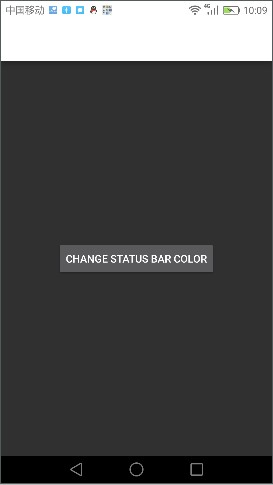

StatusBarCompat
---

[  ](https://bintray.com/msdx/maven/StatusBarCompat/_latestVersion)

# 简介
StatusBarCompat是一个用于设置系统状态栏颜色的兼容库，兼容Android 4.4.2(API 19)以上，使用简单，仅需要一行代码的调用。

# 效果展示




#使用方式

##声明仓库
确保在你的根项目的build.gradle中对`jcenter`的声明：
```gradle
allprojects {
    repositories {
        jcenter()
    }
}
```

## 声明依赖
在你要使用的module的`build.gradle`文件中声明以下依赖：
```gradle
    compile 'com.githang:status-bar-compat:0.3'
```

##代码调用
最后在你的Activity的onCreate代码中调用以下代码就可以了。
```java
    StatusBarCompat.setStatusBarColor(this, color, lightStatusBar);
```

#适配支持情况

## 第三方ROM适配支持
ROM | 是否支持
:---:|:---:
MIUI（小米）| √
Flyme（魅族）|√

##设置失败的机型
型号 |系统版本|备注
:---:|:---:|:---:
高通 Andriod L Device1 |4.4.4(SDK 19)|状态栏还是为黑色

## 已知的设置状态栏为白色后看不清时间的机型
把状态栏设置为白色或接近白色的颜色可能导致部分机型看不清状态栏的图标与文字，原因是这些机型把设置状态栏半透明改成了全透明，而Android 6.0以下没有官方的API可以把状态栏的图标及字体设置为深色，需要定制的ROM自己提供API支持。因此，不建议把状态栏设置为白色或接近白色的颜色。

目前已知的提供了支持的ROM有MIUI以及Flyme。以下是已知的不支持的机型列表：

型号 | 系统版本 | 备注
:---:|:---:|:---:
华硕 K010|4.4.2(SDK 19)|白色字体但有阴影
Lenovo TAB S8-50F|4.4.2(SDK 19)|完全看不到时间
联想 A936|4.4.4(SDK 19)|同上
联想 K80M|4.4.4(SDK 19)|同上

以上具体机型测试结果根据在Testin上随机兼容性测试所得，测试报告地址：http://realauto.testin.cn/s/1amaujufn

# 已知问题
- 由于低于6.0以下的系统使用透明状态栏并设置`fitsSystemWindows`来实现设置状态栏颜色，在一些底部虚拟导航栏给隐藏的机型上，可能会出现界面无法显示在该区域中。如果遇到此问题，你需要把你的App theme指定为AppCompat里的一种。

# 参考资料：
- [SystemBarTint](https://github.com/jgilfelt/SystemBarTint)
- [《Android Lollipop Set Status Bar Text Color》](http://stackoverflow.com/questions/30464234/android-lollipop-set-status-bar-text-color)
- [《由沉浸式状态栏引发的血案》](http://www.jianshu.com/p/140be70b84cd?utm_source=tuicool&utm_medium=referral)
- [《android状态栏一体化(改变状态栏的背景颜色)》](http://blog.csdn.net/jdsjlzx/article/details/41643587)
- [《Remove action bar shadow programmatically》](http://stackoverflow.com/questions/19922078/remove-action-bar-shadow-programmatically)
- [《Android-->沉浸式状态栏字体颜色的修改(只针对小米和魅族)》](http://blog.csdn.net/angcyo/article/details/49834739)
